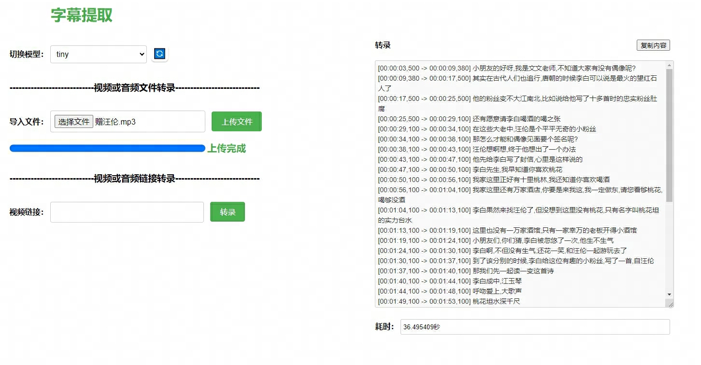

**whisper对比（GTX1660TI 6G）：**

|                      | whisper（<https://github.com/openai/whisper>）               | faster-whisper （<https://github.com/guillaumekln/faster-whisper>） | whisper-jax（<https://github.com/sanchit-gandhi/whisper-jax>） |
| -------------------- | ------------------------------------------------------------ | ------------------------------------------------------------ | ------------------------------------------------------------ |
| 性能（tiny）         | 时间长加载模型时间为：2.994363秒 第一次执行时间为：27.354811秒 第二次执行时间为：46.858829秒 | 较好加载模型时间为：2.248767秒 第一次执行时间为：16.504296秒 第二次执行时间为：29.301707秒 | 较好加载模型时间为：3.910352秒 第一次执行时间为：27.252411秒 第二次执行时间为：39.111115秒；使用large模型比前两者快、官方说快70倍，有限制：在tpu（5倍）上开启jax加速（2倍），分批次运行（7倍），分批次可能会降低准确度 |
| 准确度（和模型相关） |                                                              |                                                              |                                                              |
| 资源占用             | 高                                                           | 比较低                                                       | 较高                                                         |
| 其它                 | 安装简单、文档全面、参数灵活一般、返回格式友好               | 安装简单、文档全面、参数灵活、返回格式友好                   | 第二次执行较快，使用cache、文档较少、安装复杂、环境依赖度高、参数可调度低、返回数据格式不友好 |

**模型识别中文对比（**大小：6.84MB **）：**

Metadata:
    encoder         : Lavf58.29.100
  Duration: 00:07:28.78, start: 0.025057, bitrate: 128 kb/s
  Stream #0:0: Audio: mp3, 44100 Hz, stereo, fltp, 128 kb/s
    Metadata:
      encoder         : Lavc58.54

| 模型   | 显存       | 耗时                                               | 准确性（中文） |
| ------ | ---------- | -------------------------------------------------- | -------------- |
| tiny   | 1G以内     | 加载模型时间为：2.248767秒 执行时间为：16.504296秒 | 差             |
| base   | 1G左右     | 加载模型时间为：2.487345秒执行时间为：19.528075秒  | 一般           |
| small  | 1.8G左右   | 加载模型时间为：3.447755秒执行时间为：36.450216秒  | 较一般         |
| medium | 4G左右     | 加载模型时间为：5.807476秒执行时间为：70.634690秒  | 好             |
| large  | 6G不够没测 |                                                    | 较好           |

**主要功能：**

1.上传音频，提取字幕

2.上传视频，ffmpeg提取视频中的音频，提取字幕

3.填入音频链接，下载文件，提取字幕

4.填入视频连接，ffmpeg提取视频中的音频，提取字幕

**目录划分：**
./modules：源代码
./templates：静态页面
./models：模型目录
./upload：上传文件或通过链接的文件目录
./out-puts：输出srt字幕文件目录

**安装&启动：**（cuda：11.x，cudnn：8.x，无GPU，则使用CPU）

cuda：11.8、cudnn：8.6、ffmpeg

pytorch安装（注意版本）：

pip install torch torchvision torchaudio --index-url https://download.pytorch.org/whl/cu118

pip install -r requirements.txt

配置conf.yaml

启动执行：app.py

**后期新增**：

1.srt字幕文件下载 

2.音视频、字幕文件定期清理

**容器部署：**

1.先构建cuda+cudnn+python3.10环境的镜像

docker build -t nvidia/cuda:11.8.0-cudnn8-devel-ubuntu22.04-python310 . -f Dockerfile.env

2.构建代码镜像

docker build -t content-extract:v1.0.1 .

3.启动（挂载自行调整）

docker run --name content-extract \
	-p 8181:8181 \
	--gpus all \
	-v F:/py-workspace/content-extract/out-puts:/app/content-extract/out-puts \
	-v F:/py-workspace/content-extract/models:/app/content-extract/models \
	-v F:/py-workspace/content-extract/upload:/app/content-extract/upload \
	-d content-extract:v1.0.1